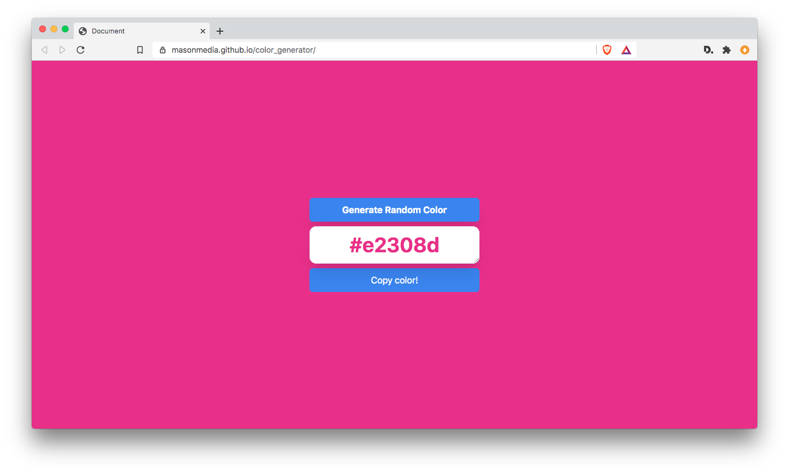

# Random Color Generator

A simple project to generate a random hex color. The generated color is applied to the page background, and the resulting hex code text printed to the textarea element. A copy button copies the current color code to the clipboard.

**The project uses HTML, Tailwind CSS, and vanilla javascript.**